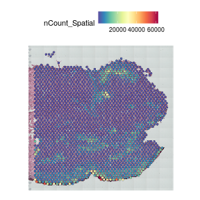
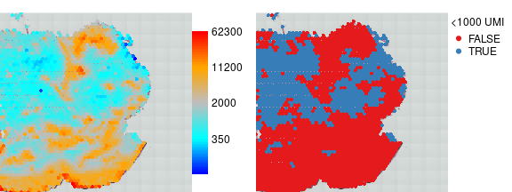
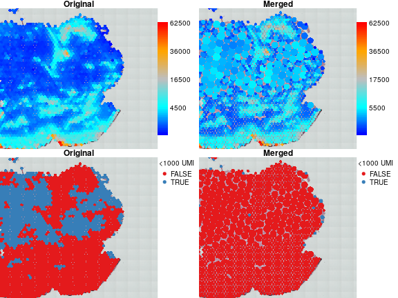
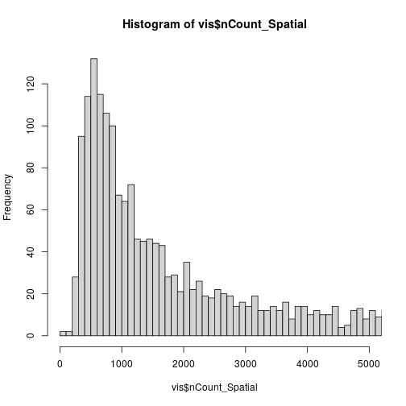
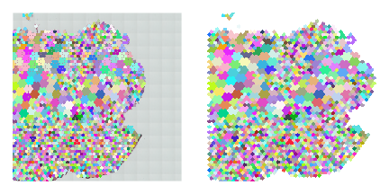

# Introduction
This document demonstrates how to group and merge visium spots with low coverage using visutils.
The spots are grouped into coarser mesh by seven spots preserving hexagonal layout. All spots from single groups with coverage below certain threshold are merged, their counts are summed and one spot is used as the representative: either the central one (if its coverage below the threshold) or the spot with highest coverage.


# Load libraries

```r
# devtools::install_github("cellgeni/visutils",force = TRUE)
library(visutils)
library(Seurat)
```

# Load data
Lets take one random skin sample from <https://spatial-skin-atlas.cellgeni.sanger.ac.uk/>.

```r
sid = 'WSSKNKCLsp12887263'
tmpfile = tempfile()
download.file(paste0('https://cellgeni.cog.sanger.ac.uk/spatial-skin-atlas/download/',sid,'.h5ad'),tmpfile,quiet = TRUE)
vis = schard::h5ad2seurat_spatial(tmpfile,use.raw = TRUE,img.res = 'hires')
```

# Check data
One can use Seurat visualization functions

```r
SpatialFeaturePlot(vis,'nCount_Spatial')
```


but here we will use visutils functions which offers more flexibility


```r
par(mfrow=c(1,2),mar=c(0,0,1,5),bty='n')
plotVisium(vis,vis$nCount_Spatial,zfun=log1p)
plotVisium(vis,vis$nCount_Spatial<1000,legend.args = list(title='<1000 UMI'))
```



so there are quite a few spots with coverage below 1000. We will merge them instead of filtering them out.

# Quick start
everything can be done just in one line

```r
umi.thr = 1000
vism = mergeSpots(vis,getCenters(vis,to.merge = vis$nCount_Spatial<umi.thr))
# lets compare merged object mobm0 with the original one
```

Lets compare coverage in original and merged objects. The spots size it proportional to sqrt of number of spots merged.

```r
par(mfrow=c(2,2),mar=c(0,0,1,5),bty='n')
plotVisium(vis,vis$nCount_Spatial,zfun = sqrt,main='Original')
plotVisium(vism,vism$nCount_Spatial,cex = vism$cex,zfun=sqrt,main='Merged') 
plotVisium(vis,vis$nCount_Spatial < umi.thr,main='Original',legend.args = list(title='<1000 UMI'))
plotVisium(vism,vism$nCount_Spatial < umi.thr,cex=vism$cex,main='Merged',legend.args = list(title='<1000 UMI')) 
```


Most of spots in merged object now have coverage above threshold, so we will lose much less data on filtering

# Details
## Choose coverage threshold

```r
hist(vis$nCount_Spatial,500,xlim=c(0,5000))
```



```r
table(vis$nCount_Spatial<umi.thr)
#> 
#> FALSE  TRUE 
#>  1337   760
```
The threshold can be set to 500, but lets keep at 1000 for demonstration propose.

## Define merging groups
We first define groups of spots to be merged by grouping these of them who have coverage lower than threshold into groups of 7 by spatial proximity.

```r
groups = getCenters(vis,to.merge = vis$nCount_Spatial<umi.thr)
groups[1:5,]
#>                    tissue row col imagerow imagecol group group.row group.col
#> AAACACCAATAACTGC-1      1  59  19     1239      989 59_19        59        19
#> AAACAGCTTTCAGAAG-1      1  43   9     1967      727 42_10        42        10
#> AAACAGGGTCTATATT-1      1  47  13     1785      832 48_12        48        12
#> AAACATGGTGAGAGGA-1      1  62   0     1102      492  62_0        62         0
#> AAACCGGGTAGGTACC-1      1  42  28     2012     1224 43_29        43        29
```

Lets check the groups visually

```r
par(mfrow=c(1,2),mar=c(1,1,1,1),bty='n')
plotVisium(vis,groups$group,plot.legend = F)
# change orientation of y axis to match H7E orientation (by default y-axis is reversed)
plotVisium(vis,groups$group,plot.legend = F,type='hex',ylim = range(vis@images$WSSKNKCLsp12887263@coordinates$row))
```


groups of adjacent spots with same color are the ones to be merged. Spots in regions with higher coverage 

## Merge spots
Now we have groups, lets use them to merge spots

```r
vism = mergeSpots(vis,groups)
vism@meta.data[1:5,]
#>                       orig.ident nCount_Spatial nFeature_Spatial            barcode in_tissue array_row array_col n_genes_by_counts
#> GACCTGGTCTGGGCGT-1 SeuratProject          32510             6971 GACCTGGTCTGGGCGT-1         1        10         0              6971
#> CCAAAGCAGTTGGTTG-1 SeuratProject           5144             2381 CCAAAGCAGTTGGTTG-1         1        10        10              2381
#> CGTACCGAAAGTCTAG-1 SeuratProject           6455             2834 CGTACCGAAAGTCTAG-1         1        10        12              2834
#> TGGATAGAGTAACAGA-1 SeuratProject           6534             2885 TGGATAGAGTAACAGA-1         1        10        14              2885
#>                    total_counts total_counts_mt pct_counts_mt total_counts_rb pct_counts_rb          barcode.1     c2l_Th     c2l_NK
#> GACCTGGTCTGGGCGT-1        32510            1347      4.143341            5681      17.47462 GACCTGGTCTGGGCGT-1 0.09709959 0.06333847
#> CCAAAGCAGTTGGTTG-1         5144             227      4.412908             823      15.99922 CCAAAGCAGTTGGTTG-1 0.02819351 0.12340139
#> CGTACCGAAAGTCTAG-1         6455             255      3.950426            1093      16.93261 CGTACCGAAAGTCTAG-1 0.03691382 0.15954026
#> TGGATAGAGTAACAGA-1         6534             252      3.856750            1097      16.78910 TGGATAGAGTAACAGA-1 0.01700469 0.15689340
#>                    c2l_APOD+ fibroblasts c2l_CD8+ T RM c2l_T reg c2l_Macro1_2    c2l_DC1 c2l_SFRP2+ fibroblasts c2l_TAGLN+ pericytes
#> GACCTGGTCTGGGCGT-1            0.02744421    0.09471750 0.1379724  0.007156359 0.16742659              0.9079282           0.01782978
#> CCAAAGCAGTTGGTTG-1            0.03865423    0.05884737 0.1420750  0.088371895 0.10303004              2.4569583           0.04073392
#> CGTACCGAAAGTCTAG-1            0.01854635    0.10915646 0.2190897  0.096210102 0.01634783              1.4929467           0.01015466
#> TGGATAGAGTAACAGA-1            0.08937889    0.06938209 0.1908971  0.133929323 0.04581218              1.2835222           0.04463618
#>                    c2l_POSTN+ fibroblasts c2l_RGS5+ pericytes    c2l_VEC    c2l_Tc c2l_ILC_NK     c2l_BC c2l_Monocytes  c2l_MastC
#> GACCTGGTCTGGGCGT-1             0.08366692          0.01735309 0.04500113 0.6560913 0.02607997 0.06697251   0.118522971 0.02552956
#> CCAAAGCAGTTGGTTG-1             0.15097042          0.07027518 0.19094650 0.1053635 0.02593999 0.24641302   0.013501134 0.16374208
#> CGTACCGAAAGTCTAG-1             0.90180142          0.07687006 0.04404044 0.1275342 0.03456035 0.27354640   0.006294652 0.28011379
#> TGGATAGAGTAACAGA-1             0.26371153          0.14347357 0.44016573 0.1694106 0.01951851 0.30195144   0.006003635 0.09620604
#>                    c2l_Melanocytes    c2l_DC2     c2l_LEC  c2l_PlasmaC c2l_PTGDS+ fibroblasts  c2l_MigDC c2l_Neuronal_SchwannC
#> GACCTGGTCTGGGCGT-1       0.8733758 0.07495213 0.002704027 0.0003887776             0.13166811 0.33293675            0.03202289
#> CCAAAGCAGTTGGTTG-1       0.1366515 0.03792663 0.116802314 0.0037468233             0.18061862 0.01437001            0.03153874
#> CGTACCGAAAGTCTAG-1       0.2779331 0.04742168 0.015545872 0.0008625661             0.07288710 0.03406875            0.02435081
#> TGGATAGAGTAACAGA-1       0.2777428 0.10709598 0.057556206 0.0007611657             0.03464078 0.18342535            0.04847370
#>                        c2l_SMC c2l_Skeletal muscle cells leiden c2l_Suprabasal keratinocytes c2l_Basal keratinocytes c2l_Chondrocytes
#> GACCTGGTCTGGGCGT-1 0.046804237                 4.4858855      3                    30.682146               5.7642651      0.083352360
#> CCAAAGCAGTTGGTTG-1 0.003544222                 0.4107982      3                     5.199662               0.4594907      0.021503296
#> CGTACCGAAAGTCTAG-1 0.001988462                 0.1983928      3                     5.404539               0.5138135      0.008831069
#> TGGATAGAGTAACAGA-1 0.004473562                 0.5372182      3                     6.869743               1.0410424      0.007542777
#>                    c2l_IL8+ DC1         library_id nspots       merged_spots cex
#> GACCTGGTCTGGGCGT-1   0.06027652 WSSKNKCLsp12887263      1 GACCTGGTCTGGGCGT-1 0.9
#> CCAAAGCAGTTGGTTG-1   0.09316662 WSSKNKCLsp12887263      1 CCAAAGCAGTTGGTTG-1 0.9
#> CGTACCGAAAGTCTAG-1   0.06230878 WSSKNKCLsp12887263      1 CGTACCGAAAGTCTAG-1 0.9
#> TGGATAGAGTAACAGA-1   0.07489332 WSSKNKCLsp12887263      1 TGGATAGAGTAACAGA-1 0.9
#>  [ reached 'max' / getOption("max.print") -- omitted 1 rows ]
```

The resultant seurat object contains summed counts, metadata table provides information about number of spots merged (nspots) and their identity (merged_spots)


```r
par(mar=c(1,1,1,5))
plotVisium(vism,vism$nCount_Spatial,zfun = log1p,cex=vism$cex)
```


