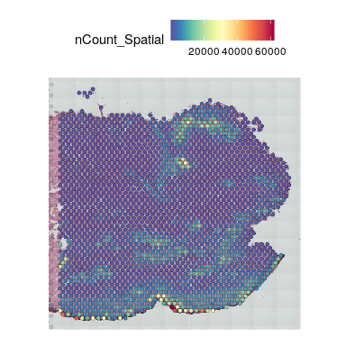
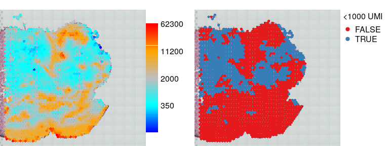
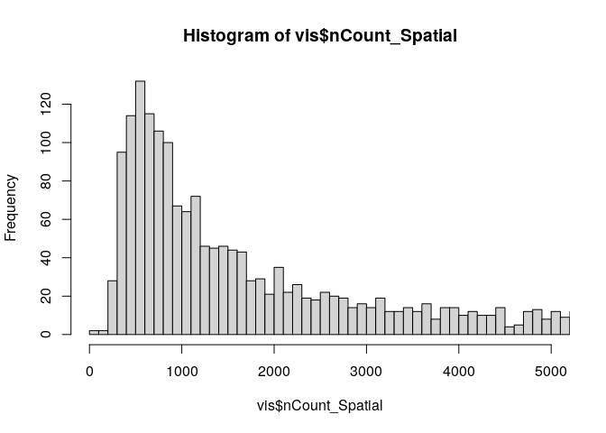
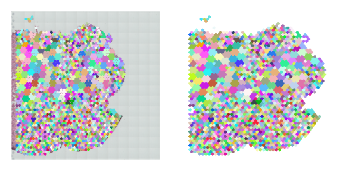
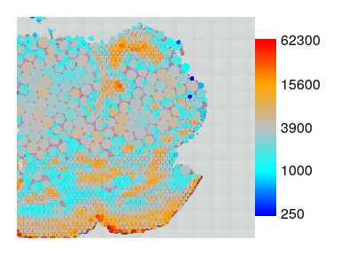

Spots merging
================

- [Intoruction](#intoruction)
- [Load libraries](#load-libraries)
- [Load data](#load-data)
- [Check data](#check-data)
- [Quick start](#quick-start)
- [Details](#details)
  - [Choose coverage threshold](#choose-coverage-threshold)
  - [Define merging groups](#define-merging-groups)
  - [Merge spots](#merge-spots)

# Intoruction

This document demonstrates how to group and merge visium spots with low
coverage using visutils. The spots are grouped into coarser mesh by
seven spots preserving hexagonal layout. All spots from single groups
with coverage below certain threshold are merged, their counts are
summed and one spot is used as the representative: either the central
one (if its coverage below the threshold) or the spot with highest
coverage.

# Load libraries

``` r
# devtools::install_github("iaaka/visutils",force = TRUE)
library(visutils)
library(Seurat)
#> Loading required package: SeuratObject
#> Loading required package: sp
#> The legacy packages maptools, rgdal, and rgeos, underpinning this package
#> will retire shortly. Please refer to R-spatial evolution reports on
#> https://r-spatial.org/r/2023/05/15/evolution4.html for details.
#> This package is now running under evolution status 0
#> 'SeuratObject' was built under R 4.3.0 but the current version is
#> 4.3.1; it is recomended that you reinstall 'SeuratObject' as the ABI
#> for R may have changed
#> 'SeuratObject' was built with package 'Matrix' 1.6.3 but the current
#> version is 1.6.4; it is recomended that you reinstall 'SeuratObject' as
#> the ABI for 'Matrix' may have changed
#> 
#> Attaching package: 'SeuratObject'
#> The following object is masked from 'package:base':
#> 
#>     intersect
```

# Load data

Lets take one random skin sample from
<https://spatial-skin-atlas.cellgeni.sanger.ac.uk/>.

``` r
sid = 'WSSKNKCLsp12887263'
tmpfile = tempfile()
download.file(paste0('https://cellgeni.cog.sanger.ac.uk/spatial-skin-atlas/download/',sid,'.h5ad'),tmpfile,quiet = TRUE)
vis = schard::h5ad2seurat_spatial(tmpfile,use.raw = TRUE,img.res = 'hires')
```

# Check data

One can use Seurat visualization functions

``` r
SpatialFeaturePlot(vis,'nCount_Spatial')
```

<!-- --> but here
we will use visutils functions which offers more flexibility

``` r
par(mfrow=c(1,2),mar=c(0,0,1,5),bty='n')
plotVisium(vis,vis$nCount_Spatial,zfun=log1p)
#> Loading required package: EBImage
plotVisium(vis,vis$nCount_Spatial<1000,legend.args = list(title='<1000 UMI'))
#> Loading required package: randomcoloR
```

<!-- -->

so there are quite a few spots with coverage below 1000. We will merge
them instead of filtering them out.

# Quick start

everything can be done just in one line

``` r
umi.thr = 1000
vism = mergeSpots(vis,getCenters(vis,to.merge = vis$nCount_Spatial<umi.thr))
#> Warning: Data is of class matrix. Coercing to dgCMatrix.
# lets compare merged object mobm0 with the original one
```

Lets compare coverage in original and merged objects. The spots size it
proportional to sqrt of number of spots merged.

``` r
par(mfrow=c(2,2),mar=c(0,0,1,5),bty='n')
plotVisium(vis,vis$nCount_Spatial,zfun = sqrt,main='Original')
plotVisium(vism,vism$nCount_Spatial,cex = vism$cex,zfun=sqrt,main='Merged') 
plotVisium(vis,vis$nCount_Spatial < umi.thr,main='Original',legend.args = list(title='<1000 UMI'))
plotVisium(vism,vism$nCount_Spatial < umi.thr,cex=vism$cex,main='Merged',legend.args = list(title='<1000 UMI')) 
```

<!-- --> Most of
spots in merged object now have coverage above threshold, so we will
lose much less data on filtering

# Details

## Choose coverage threshold

``` r
hist(vis$nCount_Spatial,500,xlim=c(0,5000))
```

<!-- -->

``` r
table(vis$nCount_Spatial<umi.thr)
#> 
#> FALSE  TRUE 
#>  1337   760
```

The threshold can be set to 500, but lets keep at 1000 for demonstration
propose.

## Define merging groups

We first define groups of spots to be merged by grouping these of them
who have coverage lower than threshold into groups of 7 by spatial
proximity.

``` r
groups = getCenters(vis,to.merge = vis$nCount_Spatial<umi.thr)
groups[1:5,]
#>                    tissue row col imagerow imagecol group group.row group.col
#> AAACACCAATAACTGC-1      1  59  19     1239      989 59_19        59        19
#> AAACAGCTTTCAGAAG-1      1  43   9     1967      727 42_10        42        10
#> AAACAGGGTCTATATT-1      1  47  13     1785      832 48_12        48        12
#> AAACATGGTGAGAGGA-1      1  62   0     1102      492  62_0        62         0
#> AAACCGGGTAGGTACC-1      1  42  28     2012     1224 43_29        43        29
```

Lets check the groups visually

``` r
par(mfrow=c(1,2),mar=c(1,1,1,1),bty='n')
plotVisium(vis,groups$group,plot.legend = F)
# change orientation of y axis to match H7E orientation (by default y-axis is reversed)
plotVisium(vis,groups$group,plot.legend = F,type='hex',ylim = range(vis@images$WSSKNKCLsp12887263@coordinates$row))
```

<!-- --> groups of
adjacent spots with same color are the ones to be merged. Spots in
regions with higher coverage

## Merge spots

Now we have groups, lets use them to merge spots

``` r
vism = mergeSpots(vis,groups)
#> Warning: Data is of class matrix. Coercing to dgCMatrix.
vism@meta.data[1:5,]
#>                       orig.ident nCount_Spatial nFeature_Spatial
#> GACCTGGTCTGGGCGT-1 SeuratProject          32510             6971
#> CCAAAGCAGTTGGTTG-1 SeuratProject           5144             2381
#> CGTACCGAAAGTCTAG-1 SeuratProject           6455             2834
#> TGGATAGAGTAACAGA-1 SeuratProject           6534             2885
#>                               barcode in_tissue array_row array_col
#> GACCTGGTCTGGGCGT-1 GACCTGGTCTGGGCGT-1         1        10         0
#> CCAAAGCAGTTGGTTG-1 CCAAAGCAGTTGGTTG-1         1        10        10
#> CGTACCGAAAGTCTAG-1 CGTACCGAAAGTCTAG-1         1        10        12
#> TGGATAGAGTAACAGA-1 TGGATAGAGTAACAGA-1         1        10        14
#>                    n_genes_by_counts total_counts total_counts_mt pct_counts_mt
#> GACCTGGTCTGGGCGT-1              6971        32510            1347      4.143341
#> CCAAAGCAGTTGGTTG-1              2381         5144             227      4.412908
#> CGTACCGAAAGTCTAG-1              2834         6455             255      3.950426
#> TGGATAGAGTAACAGA-1              2885         6534             252      3.856750
#>                    total_counts_rb pct_counts_rb          barcode.1     c2l_Th
#> GACCTGGTCTGGGCGT-1            5681      17.47462 GACCTGGTCTGGGCGT-1 0.09709959
#> CCAAAGCAGTTGGTTG-1             823      15.99922 CCAAAGCAGTTGGTTG-1 0.02819351
#> CGTACCGAAAGTCTAG-1            1093      16.93261 CGTACCGAAAGTCTAG-1 0.03691382
#> TGGATAGAGTAACAGA-1            1097      16.78910 TGGATAGAGTAACAGA-1 0.01700469
#>                        c2l_NK c2l_APOD+ fibroblasts c2l_CD8+ T RM c2l_T reg
#> GACCTGGTCTGGGCGT-1 0.06333847            0.02744421    0.09471750 0.1379724
#> CCAAAGCAGTTGGTTG-1 0.12340139            0.03865423    0.05884737 0.1420750
#> CGTACCGAAAGTCTAG-1 0.15954026            0.01854635    0.10915646 0.2190897
#> TGGATAGAGTAACAGA-1 0.15689340            0.08937889    0.06938209 0.1908971
#>                    c2l_Macro1_2    c2l_DC1 c2l_SFRP2+ fibroblasts
#> GACCTGGTCTGGGCGT-1  0.007156359 0.16742659              0.9079282
#> CCAAAGCAGTTGGTTG-1  0.088371895 0.10303004              2.4569583
#> CGTACCGAAAGTCTAG-1  0.096210102 0.01634783              1.4929467
#> TGGATAGAGTAACAGA-1  0.133929323 0.04581218              1.2835222
#>                    c2l_TAGLN+ pericytes c2l_POSTN+ fibroblasts
#> GACCTGGTCTGGGCGT-1           0.01782978             0.08366692
#> CCAAAGCAGTTGGTTG-1           0.04073392             0.15097042
#> CGTACCGAAAGTCTAG-1           0.01015466             0.90180142
#> TGGATAGAGTAACAGA-1           0.04463618             0.26371153
#>                    c2l_RGS5+ pericytes    c2l_VEC    c2l_Tc c2l_ILC_NK
#> GACCTGGTCTGGGCGT-1          0.01735309 0.04500113 0.6560913 0.02607997
#> CCAAAGCAGTTGGTTG-1          0.07027518 0.19094650 0.1053635 0.02593999
#> CGTACCGAAAGTCTAG-1          0.07687006 0.04404044 0.1275342 0.03456035
#> TGGATAGAGTAACAGA-1          0.14347357 0.44016573 0.1694106 0.01951851
#>                        c2l_BC c2l_Monocytes  c2l_MastC c2l_Melanocytes
#> GACCTGGTCTGGGCGT-1 0.06697251   0.118522971 0.02552956       0.8733758
#> CCAAAGCAGTTGGTTG-1 0.24641302   0.013501134 0.16374208       0.1366515
#> CGTACCGAAAGTCTAG-1 0.27354640   0.006294652 0.28011379       0.2779331
#> TGGATAGAGTAACAGA-1 0.30195144   0.006003635 0.09620604       0.2777428
#>                       c2l_DC2     c2l_LEC  c2l_PlasmaC c2l_PTGDS+ fibroblasts
#> GACCTGGTCTGGGCGT-1 0.07495213 0.002704027 0.0003887776             0.13166811
#> CCAAAGCAGTTGGTTG-1 0.03792663 0.116802314 0.0037468233             0.18061862
#> CGTACCGAAAGTCTAG-1 0.04742168 0.015545872 0.0008625661             0.07288710
#> TGGATAGAGTAACAGA-1 0.10709598 0.057556206 0.0007611657             0.03464078
#>                     c2l_MigDC c2l_Neuronal_SchwannC     c2l_SMC
#> GACCTGGTCTGGGCGT-1 0.33293675            0.03202289 0.046804237
#> CCAAAGCAGTTGGTTG-1 0.01437001            0.03153874 0.003544222
#> CGTACCGAAAGTCTAG-1 0.03406875            0.02435081 0.001988462
#> TGGATAGAGTAACAGA-1 0.18342535            0.04847370 0.004473562
#>                    c2l_Skeletal muscle cells leiden
#> GACCTGGTCTGGGCGT-1                 4.4858855      3
#> CCAAAGCAGTTGGTTG-1                 0.4107982      3
#> CGTACCGAAAGTCTAG-1                 0.1983928      3
#> TGGATAGAGTAACAGA-1                 0.5372182      3
#>                    c2l_Suprabasal keratinocytes c2l_Basal keratinocytes
#> GACCTGGTCTGGGCGT-1                    30.682146               5.7642651
#> CCAAAGCAGTTGGTTG-1                     5.199662               0.4594907
#> CGTACCGAAAGTCTAG-1                     5.404539               0.5138135
#> TGGATAGAGTAACAGA-1                     6.869743               1.0410424
#>                    c2l_Chondrocytes c2l_IL8+ DC1         library_id nspots
#> GACCTGGTCTGGGCGT-1      0.083352360   0.06027652 WSSKNKCLsp12887263      1
#> CCAAAGCAGTTGGTTG-1      0.021503296   0.09316662 WSSKNKCLsp12887263      1
#> CGTACCGAAAGTCTAG-1      0.008831069   0.06230878 WSSKNKCLsp12887263      1
#> TGGATAGAGTAACAGA-1      0.007542777   0.07489332 WSSKNKCLsp12887263      1
#>                          merged_spots cex
#> GACCTGGTCTGGGCGT-1 GACCTGGTCTGGGCGT-1 0.9
#> CCAAAGCAGTTGGTTG-1 CCAAAGCAGTTGGTTG-1 0.9
#> CGTACCGAAAGTCTAG-1 CGTACCGAAAGTCTAG-1 0.9
#> TGGATAGAGTAACAGA-1 TGGATAGAGTAACAGA-1 0.9
#>  [ reached 'max' / getOption("max.print") -- omitted 1 rows ]
```

The resultant seurat object contains summed counts, metadata table
provides information about number of spots merged (nspots) and their
identity (merged_spots)

``` r
par(mar=c(1,1,1,5))
plotVisium(vism,vism$nCount_Spatial,zfun = log1p,cex=vism$cex)
```

<!-- -->
