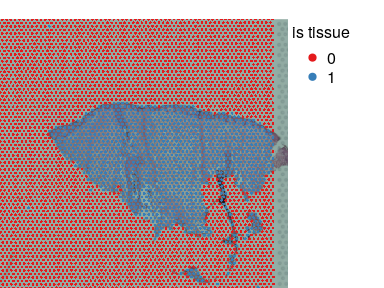
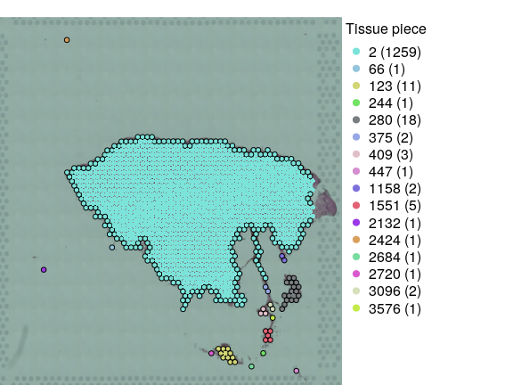
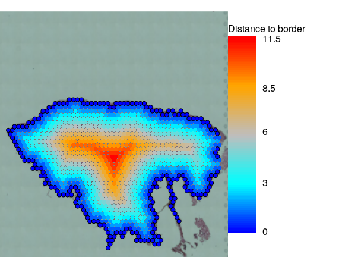
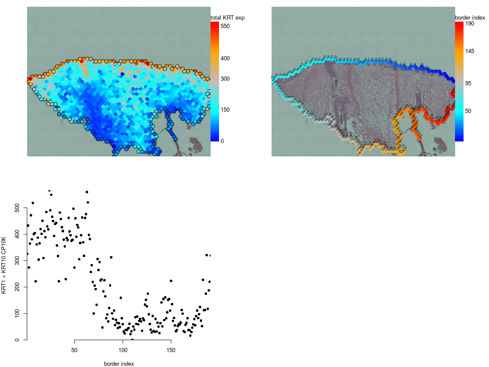
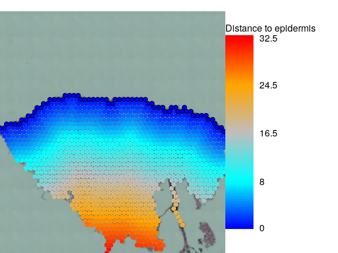

Tissue carving
================

- [Intoruction](#intoruction)
- [Load libraries](#load-libraries)
- [Load data](#load-data)
- [Define tissue pieces and their
  borders](#define-tissue-pieces-and-their-borders)
- [Define epidermis](#define-epidermis)

# Intoruction

Visium slides can contain more than one tissue piece (slice), either
because more than one slice were purposely placed on slide, or it can be
tissue derbies or false positive of spaceranger tissue autodetection.
One can deal with these problems using manual annotation in loupe
browser (for example), however it works only for small datasets. Some
automation is needed for larger ones. Here I will show how to define
tissue pieces on visium slide (starting from spaceranger tissue
autodetection), remove small one that likely to be derbies, and annotate
tissue border in semi-automated way using visutils.

# Load libraries

``` r
# devtools::install_github("iaaka/visutils",force = TRUE)
library(visutils)
library(Seurat)
#> Loading required package: SeuratObject
#> Loading required package: sp
#> The legacy packages maptools, rgdal, and rgeos, underpinning this package
#> will retire shortly. Please refer to R-spatial evolution reports on
#> https://r-spatial.org/r/2023/05/15/evolution4.html for details.
#> This package is now running under evolution status 0
#> 'SeuratObject' was built under R 4.3.0 but the current version is
#> 4.3.1; it is recomended that you reinstall 'SeuratObject' as the ABI
#> for R may have changed
#> 'SeuratObject' was built with package 'Matrix' 1.6.3 but the current
#> version is 1.6.4; it is recomended that you reinstall 'SeuratObject' as
#> the ABI for 'Matrix' may have changed
#> 
#> Attaching package: 'SeuratObject'
#> The following object is masked from 'package:base':
#> 
#>     intersect
```

# Load data

Lets take one random skin sample from
<https://www.ebi.ac.uk/biostudies/arrayexpress/studies/E-MTAB-13084> (we
need all spots including empty, so we cannot use portal).

``` r
sid = 'WSSKNKCLsp10446623'
tmpfile = tempfile()
download.file(paste0('https://www.ebi.ac.uk/biostudies/files/E-MTAB-13084/',sid,'.tar.gz'),tmpfile,quiet = TRUE)
tmpdir = tempdir()
system(paste0('cd ',tmpdir,'; tar -xzf ',tmpfile))
vis = myLoad10X_Spatial(tmpdir,filter.matrix = FALSE)
```

``` r
par(mar=c(0,0,1,5),bty='n')
plotVisium(vis,as.character(vis$is.tissue),legend.args = list(title='is tissue'),cex=0.6)
#> Loading required package: randomcoloR
#> Loading required package: EBImage
```

<!-- -->

# Define tissue pieces and their borders

``` r
border = findTissueBorder(vis)$rc
#> Loading required package: igraph
#> 
#> Attaching package: 'igraph'
#> The following object is masked from 'package:EBImage':
#> 
#>     normalize
#> The following object is masked from 'package:Seurat':
#> 
#>     components
#> The following objects are masked from 'package:stats':
#> 
#>     decompose, spectrum
#> The following object is masked from 'package:base':
#> 
#>     union
par(mar=c(0,0,1,10),bty='n')
plotVisium(vis,as.character(border$tissue.piece),
           border=ifelse(border$is.border,'black',NA),
           legend.args = list(title='Tissue piece'),show.cluster.sizes = TRUE)
```

<!-- -->

*findTissueBorder* return list of two objects, data.frame **rc** that
contains information about tissue pieces and their borders and list
**nj** that gives spatial neighbours for each spot. We will need only
the former. So, there is one large tissue piece, some obvious debris and
few larger pieces that can be probably kept but we will remove them for
now.

``` r
pieces.size = sort(table(border$tissue.piece),decreasing = TRUE)
f = !is.na(border$tissue.piece) & border$tissue.piece == names(pieces.size)[1]
visf = vis[,f]
#> Warning: Not validating Seurat objects
borderf = border[f,]
visf$distance2border = calcDistance2SpotSet(visf,borderf$is.border)

par(mar=c(0,0,1,10),bty='n')
plotVisium(visf,visf$distance2border,
           border=ifelse(borderf$is.border,'black',NA),
           legend.args = list(title='Distance to border'))
```

<!-- -->

# Define epidermis

So we successfully removed debris and found tissue border. This approach
can be also used to define two different tissue pieces analysed on the
same slide with exception that distance to border should be calculated
in per piece manner in this case. This sample it skin and piece border
is probably not very important, what one may need it skin surface that
is epidermal part of the border. Here it is on the top of skin and it
can be defined manually or one can check expression of marker genes, for
example keratins 1 and 10.

``` r
f = visf[['Spatial']]@meta.data$gene_name %in%  c('KRT1','KRT10')
krt.cp10k = colSums(visf[['Spatial']]$counts[f,,drop=FALSE])/visf$nCount_Spatial*1e4

par(mfrow=c(2,2),mar=c(4,4,1,5),bty='n')
plotVisium(visf,krt.cp10k,
           border=ifelse(borderf$is.border,'black',NA),
           legend.args = list(title='total KRT exp'))
b = plotVisium(visf,borderf$border.inx,
           legend.args = list(title='border index'))
text(b$xy[,1],b$xy[,2],borderf$border.inx,adj=c(0,0),cex=0.5,srt=60)
plot(borderf$border.inx,krt.cp10k,pch=16,xlab='border index',ylab='KRT1 + KRT10 CP10K')
```

<!-- --> Based
on H&E and keratins expression it seems that epidermis corresponds to
border spots 1-64.

``` r
visf$is.epi = !is.na(borderf$border.inx) & borderf$border.inx %in% 1:64
visf$distance2epi = calcDistance2SpotSet(visf,visf$is.epi)
par(mar=c(0,0,1,10),bty='n')
plotVisium(visf,visf$distance2epi,
           border=ifelse(visf$is.epi,'black',NA),
           legend.args = list(title='Distance to epidermis'))
```

<!-- -->

This annotation can be used for [Tissue in
depth](../vignettes/TissueInDepth.md) analyses.
