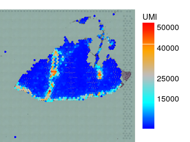
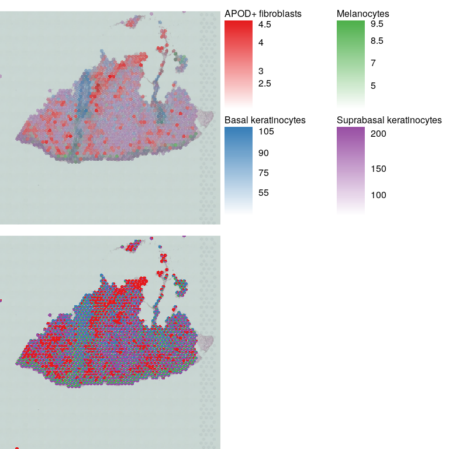
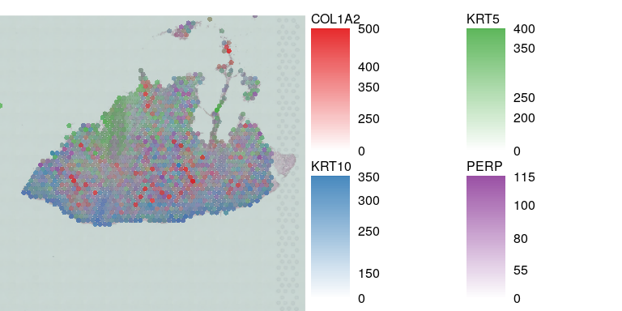

Visualization
================

- [Load libraries](#load-libraries)
- [Load data](#load-data)

# Load libraries

``` r
# devtools::install_github("iaaka/visutils",force = TRUE)
library(visutils)
library(Seurat)
#> Loading required package: SeuratObject
#> Loading required package: sp
#> The legacy packages maptools, rgdal, and rgeos, underpinning this package
#> will retire shortly. Please refer to R-spatial evolution reports on
#> https://r-spatial.org/r/2023/05/15/evolution4.html for details.
#> This package is now running under evolution status 0
#> 'SeuratObject' was built under R 4.3.0 but the current version is
#> 4.3.1; it is recomended that you reinstall 'SeuratObject' as the ABI
#> for R may have changed
#> 
#> Attaching package: 'SeuratObject'
#> The following object is masked from 'package:base':
#> 
#>     intersect
```

# Load data

Lets take one random skin sample from
<https://spatial-skin-atlas.cellgeni.sanger.ac.uk/>

``` r
sid = 'WSSKNKCLsp10446623'
tmpfile = tempfile()
download.file(paste0('https://cellgeni.cog.sanger.ac.uk/spatial-skin-atlas/download/',sid,'.h5ad'),tmpfile,quiet = TRUE)
vis = schard::h5ad2seurat_spatial(tmpfile,use.raw = TRUE,img.res = 'hires')
file.remove(tmpfile)
#> [1] TRUE
```

``` r
par(mar=c(0,0,1,5),bty='n')
plotVisium(vis,vis$nCount_Spatial,legend.args = list(title='UMI'))
#> Loading required package: EBImage
```

<!-- --> \#
Plot multiple microenvironments

``` r
c2l = as.matrix(vis@meta.data[,grep('c2l',colnames(vis@meta.data))])
colnames(c2l) = sub('c2l_','',colnames(c2l))
celltypes = char2col(c('Suprabasal keratinocytes','APOD+ fibroblasts','Basal keratinocytes','Melanocytes'))
#> Loading required package: randomcoloR
par(mfrow=c(2,1),mar=c(0,0,1,20),bty='n')
plotVisiumMultyColours(vis,c2l[,names(celltypes)],cols = celltypes,img.alpha=0.5,legend.ncol = 2)
# or as pie charts
c2l = sweep(c2l,2,apply(c2l,2,max),'/')
plotVisium(vis,pie.fracs = c2l[,names(celltypes)],pie.cols = celltypes,img.alpha=0.5)
```

<!-- --> \#
Plot multiple genes

``` r
cnts = vis@assays$Spatial@layers$counts
rownames(cnts) = vis@assays$Spatial@meta.data$`_index`

gids = char2col(c('KRT5','KRT10','COL1A2','PERP'))
cpm = t(as.matrix(cnts[names(gids),]))
cpm = sweep(cpm,1,vis$nCount_Spatial,'/')*1e4
par(mar=c(0,0,1,20),bty='n')
plotVisiumMultyColours(vis,cpm,cols = gids,img.alpha=0.5,legend.ncol = 2)
```

<!-- -->
